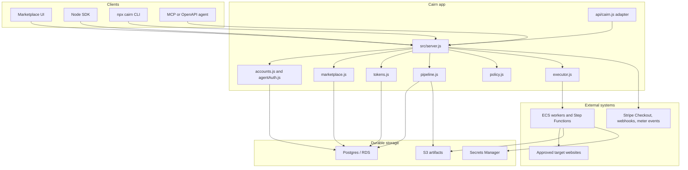
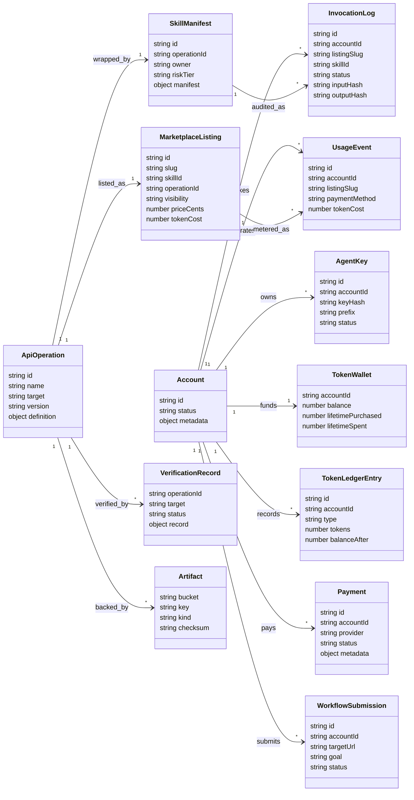
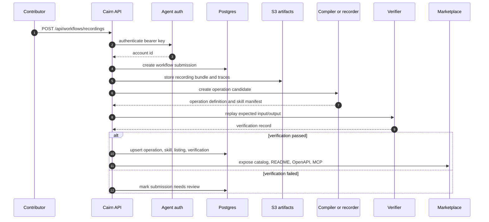
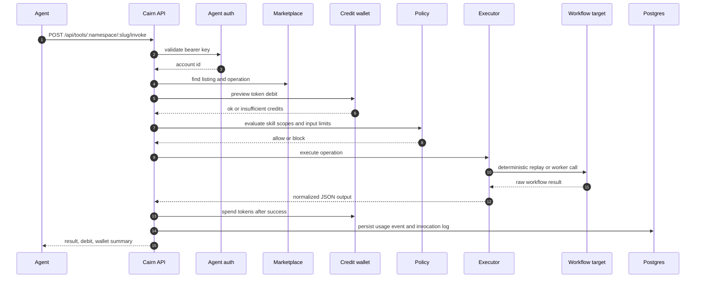
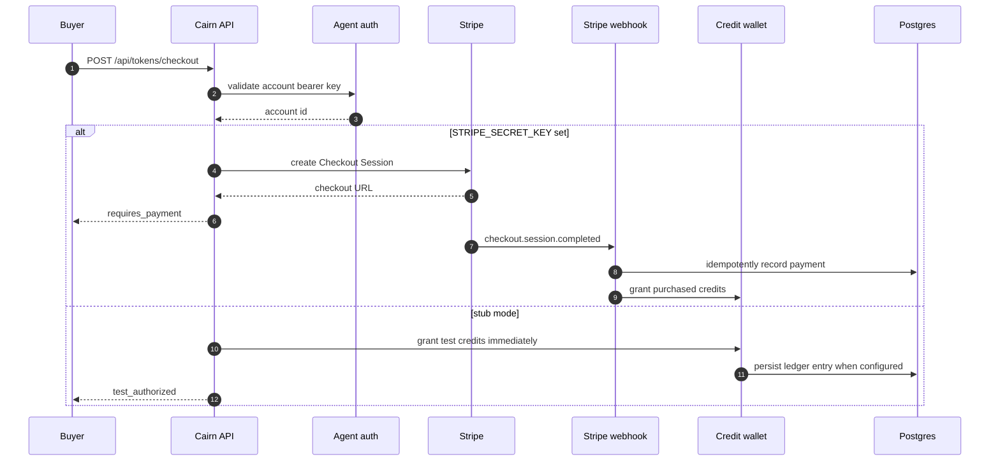
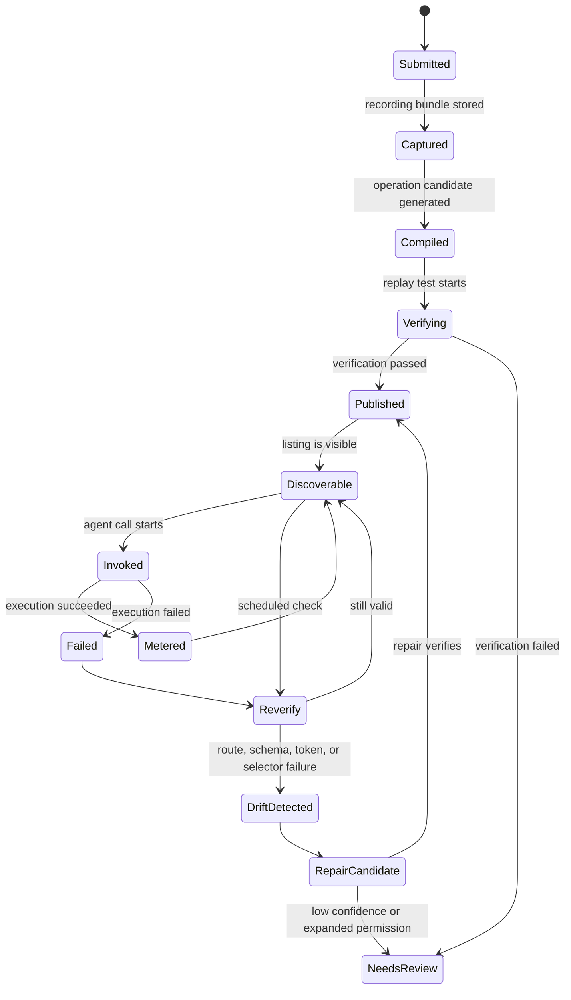
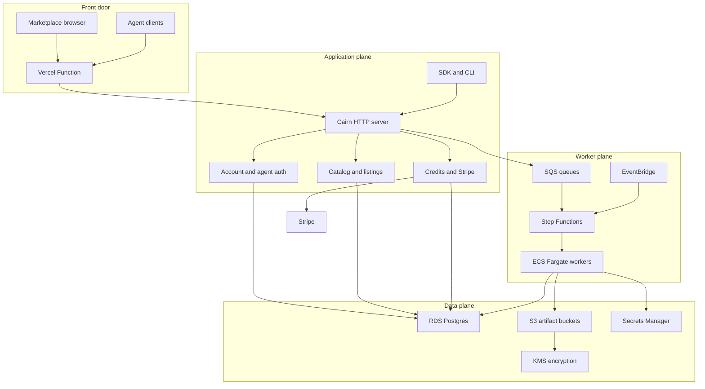

# Cairn

Cairn is a marketplace for workflow APIs that AI agents can discover, pay for, and call.

If a useful task is stuck behind a long browser workflow, someone can record that workflow, Cairn can turn it into an API, and an agent can call that API later without clicking through the website every time.

Current product shape:

- A Smithery-style marketplace for agent-ready workflow APIs, backed by stored published listings.
- A package, SDK, and CLI that agents or developers can install.
- Account wallets with Cairn credits.
- Credit purchase flow for token packs.
- Skill invocation with credits deducted only after a successful completed workflow.
- Per-skill README, OpenAPI, MCP, and integration guide endpoints.
- Stub-mode Stripe locally, with real Stripe Checkout/webhook paths ready for configuration.
- Optional Postgres persistence when `DATABASE_URL` is configured, including accounts, wallets, usage, API definitions, and verification records. Without stored published API rows, the marketplace catalog is intentionally empty.

Production URL currently used by the SDK default:

```text
https://cairn-ai-gamma.vercel.app
```

## What Is Implemented

- Marketplace homepage at `/`.
- Pricing page at `/pricing`.
- Storage-backed API catalog:
  - `/api/catalog` lists only stored, published APIs.
  - Demo fixture APIs are available only when `CAIRN_ENABLE_DEMO_LISTINGS=true`.
- Agent discovery:
  - `/.well-known/cairn.json`
  - `/openapi.json`
  - `/mcp`
  - `/api/catalog`
  - `/api/tools`
- Per-skill docs:
  - `/api/tools/:namespace/:slug/readme.md`
  - `/api/tools/:namespace/:slug/openapi.json`
- Package install surface:
  - `npm install github:arav31/Cairn-AI`
  - `const { CairnClient } = require("cairn")`
  - `npx cairn ...`
- Account and credits:
  - `POST /api/accounts`
  - `GET /api/accounts/:accountId/usage`
  - `GET /api/tokens/wallet?accountId=...`
  - `POST /api/tokens/quote`
  - `POST /api/tokens/checkout`
- Token-paid invocation:
  - `POST /api/tools/:namespace/:slug/invoke`
  - `POST /mcp` with `tools/call`
- Integration guide endpoint:
  - `/api/integrations`
  - `/api/integrations/:namespace/:slug`
- Stripe payment scaffolding:
  - Checkout Sessions for direct API payment.
  - Checkout Sessions for token packs.
  - Webhook handling for `checkout.session.completed`.
  - Stripe signature verification when `STRIPE_WEBHOOK_SECRET` is set.
  - Billing meter event helper for usage billing.
- Postgres schema and migration:
  - Accounts.
  - Published APIs.
  - Skill manifests.
  - Marketplace listings.
  - Verification records.
  - Workflow submissions.
  - Token wallets.
  - Token ledger.
  - Usage events.
  - Payments.
  - Invocation logs.
- AWS setup helper:
  - `infra/aws/cloudshell-setup.sh`
  - Creates/verifies RDS, SQS queues, EventBridge bus, and Secrets Manager secret.
- Vercel deployment adapter:
  - `api/cairn.js`
  - `vercel.json`

## How Cairn Works

Cairn converts a useful browser workflow into a productized API that agents can discover, pay for, and call. The current codebase is intentionally small enough to run locally as one Node HTTP server, but it already models the production system boundaries: account identity, credit wallets, marketplace listings, skill manifests, verification records, invocation logs, Stripe payment scaffolding, Postgres persistence, Vercel routing, and AWS artifact/worker infrastructure.

The lifecycle is:

1. A contributor submits or records a workflow that is stuck behind a browser UI.
2. Cairn stores the raw evidence and generated artifacts in S3, with durable rows in Postgres.
3. The compiler turns evidence into an operation definition: input schema, output schema, execution plan, selectors, allowed domains, success predicates, and OpenAPI.
4. The verifier replays the operation against known input and expected output.
5. A verified operation is wrapped as a skill manifest and published as a marketplace listing.
6. Agents discover the listing through the UI, OpenAPI, MCP, SDK, CLI, or per-skill README endpoints.
7. A buyer creates an account and funds credits, or authorizes direct payment.
8. Invocation checks agent auth, wallet balance or payment authorization, listing policy, scopes, input constraints, and operation status.
9. The workflow executes through deterministic replay or a worker-backed browser fallback.
10. Credits are debited only after successful execution, usage is recorded, and the agent receives normalized JSON.
11. Scheduled verification detects drift. Repair jobs generate a new operation version and publish only after verification passes.

Core invariants:

- Agents call typed contracts, not raw browser sessions.
- Every marketplace listing points to a versioned operation, skill manifest, and verification record.
- Published APIs must be verified before they are listed.
- Session secrets, CSRF tokens, cookies, payment credentials, and browser state stay outside agent-visible schemas.
- Account-scoped agent keys are hashed before storage.
- Credits are previewed before execution and debited after success.
- Invocation logs store hashes and metadata so usage is auditable without exposing full payloads by default.

## Architecture Overview



The local demo can run without Postgres, AWS, or Stripe. In that mode state is held in memory and Stripe is stubbed. Production should configure `DATABASE_URL`, run migrations, store artifacts in S3, and sync AWS/Stripe environment values to Vercel.

### Runtime Responsibilities

| Area | Files | Responsibility |
| --- | --- | --- |
| HTTP server | `src/server.js` | Routing, static pages, JSON APIs, MCP surface, sandbox demo endpoints |
| Vercel adapter | `api/cairn.js`, `vercel.json` | Runs the same Node app as a Vercel Function |
| SDK and CLI | `src/sdk/client.js`, `bin/cairn.js` | Catalog, accounts, wallet, credits, README, and invocation commands |
| Accounts and auth | `src/cairn/accounts.js`, `src/cairn/agentAuth.js` | Account creation, bearer key issuing, key hashing, request authentication |
| Marketplace | `src/cairn/marketplace.js` | Listing creation, catalog APIs, OpenAPI generation, integration guides, quote and checkout helpers |
| Credits | `src/cairn/tokens.js` | Token packs, wallets, ledger, checkout, debit preview, post-success spend |
| Persistence | `src/cairn/database.js`, `migrations/001_initial_schema.sql` | Postgres schema, migrations, published API loading, wallet and usage persistence |
| Pipeline | `src/cairn/pipeline.js` | Recording, synthesis, verification, publishing, invocation, reverify, repair |
| Execution | `src/cairn/executor.js` | Input validation, deterministic replay, fixture execution, output matching, failure classification |
| Policy | `src/cairn/policy.js` | Skill approval, scope checks, simple input limits, invocation audit records |
| Synthesis and repair | `src/cairn/synthesizer.js`, `src/cairn/repair.js` | Demo compiler, fresh-token lifting, drift classification, repaired operation proposals |
| AWS setup | `infra/aws/cloudshell-setup.sh`, `docs/AWS_STORAGE.md`, `docs/AWS_DATABASE.md` | RDS, S3, SQS, EventBridge, and Secrets Manager setup guidance |

## UML Diagrams

### Domain Model



### Publish A Workflow



### Invoke A Skill With Credits



### Stripe Token Pack Checkout



### Operation Lifecycle



### Target Production Deployment



## Software Engineering Plan

This plan describes how Cairn moves from the current marketplace and SDK foundation into a production workflow API platform.

### Phase 0: Keep The Demo And Docs Honest

Goal: keep the local and hosted app understandable while the platform grows.

Deliverables:

- Keep `npm start`, `npm test`, SDK commands, CLI commands, and Vercel routing working.
- Keep the README aligned with the real code paths, database tables, AWS setup, and payment behavior.
- Make demo fixture APIs opt-in through `CAIRN_ENABLE_DEMO_LISTINGS=true`.
- Keep local stub mode useful when Postgres, Stripe, and AWS are not configured.

Acceptance criteria:

- A new developer can create an account, fund credits, invoke a demo skill, and inspect the relevant code from the README alone.
- Tests pass locally with and without `DATABASE_URL`.

### Phase 1: Harden Persistence And Idempotency

Goal: make Postgres the source of truth for accounts, listings, wallets, ledgers, payments, usage, submissions, and verification records.

Deliverables:

- Migration coverage for all current tables plus indexes for account, listing slug, operation id, invocation id, and payment id.
- Repository functions around marketplace publication, account auth, token grants, token debits, usage events, and invocation logs.
- Idempotency keys for checkout completion, token grant, token debit, usage event, and invocation log writes.
- Backfill and seed tooling for initial published APIs.

Acceptance criteria:

- Restarting the server does not lose account balances, listings, usage, or verification state.
- Replaying the same webhook or invocation id does not double-credit or double-debit.

### Phase 2: Define Artifact Contracts

Goal: standardize the boundary between recording tools, compilers, workers, and the marketplace.

Deliverables:

- Versioned JSON schemas for recording bundles, operation definitions, skill manifests, verification records, repair proposals, and listing manifests.
- S3 key layout for recordings, traces, screenshots, generated OpenAPI, generated README, and verification evidence.
- Manifest checksum and source-commit metadata for preloaded skill packages.
- Promotion API that accepts artifacts, verifies them, and upserts durable database rows.

Acceptance criteria:

- A skill package can be loaded from S3, checked against a manifest, and promoted without manual database edits.
- The database stores small queryable records while S3 stores large immutable evidence and generated artifacts.

### Phase 3: Workerize Execution

Goal: move slow or risky work out of the Vercel request path.

Deliverables:

- SQS queues for recording, synthesis, verification, invocation, and repair.
- Step Functions workflows for long-running jobs.
- ECS Fargate workers for deterministic HTTP replay and browser replay.
- Worker status events through EventBridge.
- Timeouts, retries, cancellation, and failure classification for every worker job.

Acceptance criteria:

- API endpoints can enqueue work and return status without exceeding Vercel function limits.
- Invocation failures return structured codes such as `auth_expired`, `changed_route`, `stale_token`, `selector_failure`, and `changed_response_schema`.

### Phase 4: Publish And Discover Real Skills

Goal: make marketplace supply real, searchable, installable, and verifiable.

Deliverables:

- Contributor profile and ownership model for listings.
- Listing approval workflow with verification freshness and rollback controls.
- Per-skill docs generated from the operation contract.
- Search and filters for category, risk tier, price, health, verification status, and supported agent client.
- Hosted MCP configuration and OpenAPI export per listing.

Acceptance criteria:

- A real published skill has a listing, README, OpenAPI schema, verification record, price, owner, scopes, health score, and rollback version.
- Agents can discover and invoke the skill through SDK, CLI, MCP, or REST.

### Phase 5: Complete Payments And Credits

Goal: support low-friction agent payments while keeping accounting correct.

Deliverables:

- Stripe products and prices for token packs.
- Optional Stripe products and prices for direct per-call APIs.
- Verified webhook handling for token purchases.
- Ledger adjustments, refunds, spend limits, and approval thresholds.
- Usage billing meter events for larger accounts.

Acceptance criteria:

- Paid calls do not run without account authorization or payment authorization.
- Credits are debited exactly once after a successful invocation.
- Failed or blocked invocations do not spend credits.

### Phase 6: Security And Governance

Goal: make repeated agent calls safe for real organizations.

Deliverables:

- Account/team/tenant ownership for wallets, listings, submissions, and API keys.
- Skill scopes, risk tiers, per-skill rate limits, and domain allowlists.
- Secret references resolved only inside workers.
- Trace redaction before LLM-assisted repair.
- Audit exports for compliance reviewers.
- Human approval for destructive workflows, new domains, payment-moving workflows, and permission expansion.

Acceptance criteria:

- Every invocation has an account, agent key, listing, skill, operation version, policy decision, payment state, and audit record.
- Operation definitions never contain raw credentials, session cookies, or long-lived secrets.

### Phase 7: Reliability And Drift Repair

Goal: keep published skills healthy when target websites change.

Deliverables:

- Scheduled reverification for every published listing.
- Health score based on pass rate, latency, freshness, and recent failures.
- Repair proposals backed by trace diffs and confidence scores.
- Rollback to last verified operation version.
- Alerts for repeated drift, target outages, or high invocation failure rates.

Acceptance criteria:

- Drift is visible in the marketplace before users trust a stale listing.
- Safe route or selector repairs can publish automatically after verification.
- Low-confidence or risky repairs produce a human review packet.

## Quality Plan

Testing should grow in layers:

- Unit tests for auth, policy, token math, payment metadata, failure classification, synthesis helpers, and repair decisions.
- Contract tests for generated OpenAPI, MCP tool definitions, listing JSON, SDK request payloads, and S3 manifests.
- Integration tests for account creation, token checkout, webhook reconciliation, quote, invoke, debit, usage, and invocation logging.
- Database tests for migrations, idempotency, durable catalog load, and concurrent debits.
- Golden replay tests for recorded workflows with fixed artifacts and expected outputs.
- Worker tests for timeout, retry, cancellation, failure code mapping, and artifact writes.
- Security tests for bearer key handling, account matching, scope enforcement, domain allowlists, input limits, and secret references.
- Load tests for catalog browsing, wallet reads, MCP tool listing, and queued invocations.

Production readiness gates:

- Every public listing has passing verification evidence.
- Every payment path is idempotent.
- Every worker job writes status, logs, timeout state, and final artifact pointers.
- Every secret is stored outside the operation contract.
- Every listing exposes price, scopes, health, freshness, and rollback version.

## Preloaded Skills And S3 Artifacts

The `final-skill-operation` branch includes a preloaded skill package used for the insurance marketplace demo and learned JSON skills. Main production should treat those as importable artifacts, not as hardcoded marketplace supply.

Recommended S3 layout:

```text
s3://cairn-api-artifacts-prod/preloaded-skills/<package-version>/manifest.json
s3://cairn-api-artifacts-prod/preloaded-skills/<package-version>/skills/<skill-id>.json
s3://cairn-api-artifacts-prod/preloaded-skills/<package-version>/marketplace/skills.json
s3://cairn-api-artifacts-prod/preloaded-skills/<package-version>/marketplace/insurance-skills.json
s3://cairn-api-artifacts-prod/preloaded-skills/<package-version>/marketplace/SKILL_OPERATION_README.md
s3://cairn-api-artifacts-prod/preloaded-skills/<package-version>/public/insurance-marketplace.html
s3://cairn-api-artifacts-prod/preloaded-skills/<package-version>/public/insurance-marketplace.css
s3://cairn-api-artifacts-prod/preloaded-skills/<package-version>/public/insurance-marketplace.js
```

The manifest should include:

- source repository, branch, commit, and generation time
- package version and checksum
- skill id, name, description, source URL, input count, step count, output count, execution strategy, and primary endpoint
- object keys for every skill, marketplace listing, README, static asset, trace, and verification artifact
- promotion status: draft, verified, published, deprecated, or rejected

Promotion flow:

1. Upload package artifacts to S3.
2. Validate the manifest and checksums.
3. Insert or update operation definitions, skill manifests, marketplace listings, and verification records.
4. Mark listings as public only after verification passes.
5. Keep the S3 package immutable and publish updates as a new package version.

## Risk Register

| Risk | Impact | Mitigation |
| --- | --- | --- |
| Target site changes route, token behavior, or response schema | Published skill fails or returns stale data | Scheduled verification, structured failure codes, repair jobs, rollback |
| Credits are double spent or double granted | Accounting loss and user distrust | Idempotency keys, database constraints, webhook replay tests |
| Agent key leaks | Unauthorized wallet or invocation access | Hash keys, prefix-only display, revocation, rate limits, short-lived future auth |
| Secrets enter operation JSON or traces | Security incident | Secret handles only, worker-side resolution, trace redaction |
| Browser replay becomes the default | Slow, expensive, brittle execution | Prefer deterministic endpoint replay, reserve browser replay for fallback |
| Low-quality generated skill gets published | Marketplace trust loss | Verification gate, human review, quality scoring, rollback |
| Vercel function times out on long jobs | Failed invocations and poor UX | Worker queues, Step Functions, async status events |
| Demo listings are mistaken for real supply | Misleading marketplace | Keep demo listings opt-in and require stored published rows for production |

## Quickstart

Install dependencies:

```bash
npm install
```

Create a local env file:

```bash
cp .env.example .env
```

Start the app:

```bash
npm start
```

Open:

```text
http://localhost:3000
http://localhost:3000/pricing
```

If port `3000` is busy:

```bash
PORT=3005 npm start
```

Run tests:

```bash
npm test
```

## Install The Package

The package is not published to npm yet. Install it from GitHub for now:

```bash
npm install github:arav31/Cairn-AI
```

Use the SDK:

```js
const { CairnClient } = require("cairn");

const cairn = new CairnClient({
  baseUrl: "https://cairn-ai-gamma.vercel.app",
  accountId: "demo-user",
  agentKey: process.env.CAIRN_AGENT_KEY
});

const account = await cairn.createAccount();
process.env.CAIRN_AGENT_KEY ||= account.agentAuth.agentKey;
await cairn.buyTokens("starter");

const result = await cairn.invoke("insurance/compare-insurance-prices", {
  input: {
    coverageType: "auto",
    zipCode: "78701",
    driverAge: 35,
    vehicleYear: 2021
  },
  paymentMethod: "tokens"
});
```

Use the CLI:

```bash
npx cairn account create --account demo-user --base-url https://cairn-ai-gamma.vercel.app
npx cairn buy-tokens --pack starter --account demo-user --base-url https://cairn-ai-gamma.vercel.app
npx cairn invoke \
  --tool insurance/compare-insurance-prices \
  --account demo-user \
  --base-url https://cairn-ai-gamma.vercel.app \
  --input '{"coverageType":"auto","zipCode":"78701","driverAge":35,"vehicleYear":2021}'
```

Useful CLI commands:

```bash
npx cairn catalog
npx cairn guide
npx cairn guide --tool insurance/compare-insurance-prices
npx cairn wallet --account demo-user
npx cairn readme --tool real-estate/search-properties
```

## Account And Credit Flow

Cairn uses account-scoped credit wallets. In the current demo, an account is identified by an `accountId`. When `DATABASE_URL` is configured, that account is a durable row in Postgres and all wallet, ledger, payment, usage, invocation, and workflow-submission records attach to it.

Agent auth is now account-scoped. `POST /api/accounts` returns an `agentAuth.agentKey` once for a new account. Store it as `CAIRN_AGENT_KEY` and send it as `Authorization: Bearer <agentKey>` for wallet, checkout, MCP `tools/call`, workflow submission, and invoke calls. Cairn stores only a SHA-256 hash of the key.

Create or load an account:

```bash
curl -X POST http://localhost:3000/api/accounts \
  -H "Content-Type: application/json" \
  -d '{"accountId":"demo-user"}'
```

Check wallet and recent ledger entries:

```bash
curl "http://localhost:3000/api/tokens/wallet?accountId=demo-user" \
  -H "Authorization: Bearer $CAIRN_AGENT_KEY"
```

Check account usage:

```bash
curl "http://localhost:3000/api/accounts/demo-user/usage" \
  -H "Authorization: Bearer $CAIRN_AGENT_KEY"
```

Buy credits:

```bash
curl -X POST http://localhost:3000/api/tokens/checkout \
  -H "Authorization: Bearer $CAIRN_AGENT_KEY" \
  -H "Content-Type: application/json" \
  -d '{
    "packId": "starter",
    "accountId": "demo-user"
  }'
```

Local behavior:

- If `STRIPE_SECRET_KEY` is blank, token checkout runs in stub mode and credits the wallet immediately.
- If `STRIPE_SECRET_KEY` is set, token checkout creates a Stripe Checkout Session.
- The Stripe webhook credits the wallet after a paid `checkout.session.completed` token-pack event.

## Invoke A Skill With Credits

Call an API with `paymentMethod: "tokens"`:

```bash
curl -X POST http://localhost:3000/api/tools/insurance/compare-insurance-prices/invoke \
  -H "Authorization: Bearer $CAIRN_AGENT_KEY" \
  -H "Content-Type: application/json" \
  -d '{
    "paymentMethod": "tokens",
    "tokenAccountId": "demo-user",
    "input": {
      "coverageType": "auto",
      "zipCode": "78701",
      "driverAge": 35,
      "vehicleYear": 2021
    }
  }'
```

Credit behavior:

- Cairn checks the wallet before running the workflow.
- If the wallet has too few credits, the workflow does not run.
- If the workflow is blocked by policy, credits are not deducted.
- If the workflow fails, credits are not deducted.
- If the workflow completes successfully, Cairn deducts the skill token cost.
- The debit is idempotent when a database is configured, using the invocation id.

The successful response includes:

```json
{
  "paymentMode": "tokens",
  "tokenDebit": {
    "ok": true,
    "tokenCost": 1,
    "wallet": {
      "accountId": "demo-user",
      "balance": 249
    }
  },
  "result": {
    "allowed": true,
    "output": {}
  }
}
```

## Demo Fixture APIs

| API | Endpoint | Cash price | Credit price |
| --- | --- | ---: | ---: |
| Compare Insurance Prices | `/api/tools/insurance/compare-insurance-prices/invoke` | `$0.03` | `1 token` |
| Search Properties | `/api/tools/real-estate/search-properties/invoke` | `$0.04` | `1 token` |

These are synthetic fixture workflows, not real hosted marketplace supply. They are hidden by default so the deployed marketplace does not pretend to have APIs before anything is published.

Enable them only for local demos or tests:

```bash
CAIRN_ENABLE_DEMO_LISTINGS=true npm start
```

Real marketplace rows must come from storage: an operation definition, skill manifest, listing, and verification record in Postgres. S3 stores the larger immutable artifacts behind those rows.

## Pricing

Current token packs:

| Pack | Tokens | Price | Approx. cost |
| --- | ---: | ---: | ---: |
| Starter | `250` | `$0.99` | `0.40 cents/token` |
| Builder | `1,500` | `$4.99` | `0.33 cents/token` |
| Team | `7,500` | `$19.99` | `0.27 cents/token` |

Direct per-call payment is also supported through `/quote`, `/checkout`, and `/invoke`, but tokens are the smoother path for agents because a buyer can fund once and spend across all marketplace APIs.

## Agent Endpoints

Discovery:

```http
GET /.well-known/cairn.json
GET /api/catalog
GET /api/tools
GET /openapi.json
GET /api/integrations
POST /mcp
```

Tool details:

```http
GET /api/tools/:namespace/:slug
GET /api/tools/:namespace/:slug/readme.md
GET /api/tools/:namespace/:slug/openapi.json
GET /api/tools/:namespace/:slug/verification
GET /api/integrations/:namespace/:slug
```

Tool payment and invocation:

```http
POST /api/tools/:namespace/:slug/quote
POST /api/tools/:namespace/:slug/checkout   # requires agent bearer key
POST /api/tools/:namespace/:slug/invoke     # requires agent bearer key
```

Accounts and credits:

```http
POST /api/accounts
GET /api/accounts/:accountId/usage          # requires matching agent bearer key
GET /api/tokens/config
GET /api/tokens/wallet?accountId=demo-user  # requires matching agent bearer key
POST /api/tokens/quote
POST /api/tokens/checkout                   # requires matching agent bearer key
```

Stripe helpers:

```http
GET /api/payments/stripe-config
POST /api/payments/quote
POST /api/payments/checkout                 # requires agent bearer key
POST /api/payments/usage                    # requires agent bearer key
POST /api/stripe/webhook
```

Contribution:

```http
POST /api/workflows/recordings
```

## MCP Usage

List tools:

```bash
curl -X POST http://localhost:3000/mcp \
  -H "Content-Type: application/json" \
  -d '{
    "jsonrpc": "2.0",
    "id": "tools",
    "method": "tools/list"
  }'
```

Call a tool with credits:

```bash
curl -X POST http://localhost:3000/mcp \
  -H "Content-Type: application/json" \
  -d '{
    "jsonrpc": "2.0",
    "id": "call-1",
    "method": "tools/call",
    "params": {
      "name": "compareInsurancePrices",
      "paymentMethod": "tokens",
      "tokenAccountId": "demo-user",
      "arguments": {
        "coverageType": "auto",
        "zipCode": "78701",
        "driverAge": 35,
        "vehicleYear": 2021
      }
    }
  }'
```

## Submit A Workflow

The homepage has a contribution form for workflow ideas. It posts to:

```http
POST /api/workflows/recordings
```

Example payload:

```json
{
  "title": "Compare flight refund options",
  "targetUrl": "https://example.com/account/trips",
  "goal": "Return refund eligibility, policy notes, and next available action.",
  "artifacts": []
}
```

This is currently an accepted upload stub. The marketplace side is ready to accept submissions; the recorder/compiler tooling still needs to attach real artifacts, verification, and listing publication.

## Stripe Configuration

The app loads `.env` from the repo root when `npm start` runs. Real `.env` files are ignored by Git; `.env.example` is the committed template.

Core payment variables:

```bash
STRIPE_SECRET_KEY=sk_test_...
STRIPE_WEBHOOK_SECRET=whsec_...
CAIRN_PUBLIC_URL=https://your-domain.example
```

Optional per-listing Stripe Price IDs:

```bash
STRIPE_PRICE_INSURANCE_COMPARE=price_...
STRIPE_PRICE_PROPERTY_SEARCH=price_...
```

Optional token pack Price IDs:

```bash
STRIPE_PRICE_TOKENS_STARTER=price_...
STRIPE_PRICE_TOKENS_BUILDER=price_...
STRIPE_PRICE_TOKENS_TEAM=price_...
```

Optional usage billing:

```bash
STRIPE_METER_EVENT_NAME=cairn_api_call
```

Stub mode:

- Blank `STRIPE_SECRET_KEY` means no real Stripe calls are made.
- API checkout returns a test authorization.
- Token checkout grants a test token pack immediately.
- Usage billing returns a stub response.

Real mode:

- Set `STRIPE_SECRET_KEY`.
- Set `CAIRN_PUBLIC_URL`.
- Configure `STRIPE_WEBHOOK_SECRET`.
- Point Stripe webhooks at `POST /api/stripe/webhook`.
- Listen for `checkout.session.completed`.
- Token pack Checkout Sessions include `metadata.kind=token_pack`, `metadata.account_id`, `metadata.pack_id`, and `metadata.tokens`.

## Environment Variables

Server:

| Name | Required | Used for |
| --- | --- | --- |
| `PORT` | no | Local HTTP port. Defaults to `3000`. |
| `HOST` | no | Bind host. Defaults to `127.0.0.1`; use `0.0.0.0` in containers. |
| `CAIRN_PUBLIC_URL` | production | Public app URL used for Stripe Checkout return URLs and Vercel base URL fallback. |

SDK/CLI:

| Name | Required | Used for |
| --- | --- | --- |
| `CAIRN_BASE_URL` | optional | Marketplace URL for the SDK/CLI. Defaults to production. |
| `CAIRN_ACCOUNT_ID` | optional | Default account ID for the SDK/CLI. Defaults to `demo-user`. |
| `CAIRN_AGENT_KEY` | protected API calls | Bearer key returned once by `POST /api/accounts`. Required for wallet, checkout, invoke, usage, workflow submission, and MCP `tools/call`. |

Stripe:

| Name | Required | Used for |
| --- | --- | --- |
| `STRIPE_SECRET_KEY` | production payments | Creates Stripe Checkout Sessions and meter events. Blank means stub mode. |
| `STRIPE_WEBHOOK_SECRET` | production payments | Verifies Stripe webhook signatures. |
| `STRIPE_PRICE_INSURANCE_COMPARE` | optional | Prebuilt Stripe Price for the insurance API. |
| `STRIPE_PRICE_PROPERTY_SEARCH` | optional | Prebuilt Stripe Price for the property API. |
| `STRIPE_METER_EVENT_NAME` | optional | Shared Stripe meter event name for usage billing. |
| `STRIPE_PRICE_TOKENS_STARTER` | optional | Prebuilt Stripe Price for the Starter token pack. |
| `STRIPE_PRICE_TOKENS_BUILDER` | optional | Prebuilt Stripe Price for the Builder token pack. |
| `STRIPE_PRICE_TOKENS_TEAM` | optional | Prebuilt Stripe Price for the Team token pack. |

Database:

| Name | Required | Used for |
| --- | --- | --- |
| `DATABASE_URL` | production database | RDS/Postgres connection string. Enables persistent marketplace and token state. |
| `DATABASE_SSL` | production database | Set to `true` for RDS. Set to `false` only for trusted local Postgres. |
| `DATABASE_SSL_REJECT_UNAUTHORIZED` | optional | Set to `true` only when a trusted CA chain is configured. |
| `DATABASE_POOL_MAX` | optional | Postgres connection pool size. Defaults to `3`. |

AWS:

| Name | Used for |
| --- | --- |
| `AWS_REGION` | AWS SDK region. |
| `AWS_ACCOUNT_ID` | AWS account ID. |
| `RDS_DB_INSTANCE_IDENTIFIER` | RDS instance name for setup scripts. |
| `RDS_DB_NAME` | Postgres database name. |
| `RDS_MASTER_USERNAME` | Postgres admin username. |
| `S3_RECORDINGS_BUCKET` | Raw workflow recordings. |
| `S3_API_ARTIFACTS_BUCKET` | Operation specs, OpenAPI files, traces, and generated artifacts. |
| `S3_TRACES_BUCKET` | Browser/proxy traces. |
| `S3_SCREENSHOTS_BUCKET` | Screenshots and visual artifacts. |
| `S3_VERIFICATION_BUCKET` | Verification run artifacts. |
| `S3_REPAIR_BUCKET` | Repair job artifacts. |
| `KMS_KEY_ARN` | KMS key for encrypted artifacts and secrets. |
| `SQS_RECORDING_QUEUE_URL` | Recording job queue. |
| `SQS_SYNTHESIS_QUEUE_URL` | Compiler job queue. |
| `SQS_VERIFICATION_QUEUE_URL` | Verification job queue. |
| `SQS_INVOCATION_QUEUE_URL` | Runtime invocation queue. |
| `SQS_REPAIR_QUEUE_URL` | Drift repair queue. |
| `EVENTBRIDGE_BUS_NAME` | Run/listing/repair event bus. |
| `SECRETS_PREFIX` | AWS Secrets Manager path prefix. |

Repair adapters:

| Name | Used for |
| --- | --- |
| `OPENAI_API_KEY` | Future computer-use repair assistant. |
| `BROWSER_USE_API_KEY` | Future Browser Use repair adapter. |

## Database Setup

Local demos run without a database. In that mode, wallets, ledgers, and logs live in process memory, and the marketplace catalog starts empty unless `CAIRN_ENABLE_DEMO_LISTINGS=true`.

Production should set `DATABASE_URL` and run:

```bash
npm run db:migrate
```

The migration file is:

```text
migrations/001_initial_schema.sql
```

When `DATABASE_URL` is set:

- Accounts persist in the `accounts` table.
- Marketplace listings are loaded from Postgres during bootstrap.
- Demo fixture APIs are not upserted unless explicitly enabled with `CAIRN_ENABLE_DEMO_LISTINGS=true`.
- Published APIs are stored as operation definitions, skill manifests, marketplace listings, and verification records.
- On boot, Cairn reloads published APIs from Postgres so hosted APIs can be listed, inspected, and checked again after a restart.
- Token wallets persist by account ID.
- Token ledger entries persist as credits and debits.
- Stub token purchases and Stripe token purchases are idempotent.
- Successful token-paid invocations debit exactly once.
- Token-paid usage events are persisted with `payment_method=tokens`.
- Direct-payment usage events are persisted with the caller account when an `accountId`, `caller.id`, or payment account is supplied.
- Invocation logs are persisted with caller/account and listing context.
- Payments are recorded for completed Stripe token checkouts.
- Workflow submissions persist with the submitting account.

Core API persistence model:

| Table | What it stores |
| --- | --- |
| `accounts` | Buyer, agent, or contributor account identity. |
| `api_operations` | Full operation definition: schemas, execution plan, OpenAPI, selectors, success predicates, and target metadata. |
| `skill_manifests` | Permissioned skill wrapper: owner, scopes, risk tier, approval state, and version pointers. |
| `marketplace_listings` | Public marketplace card: slug, pricing, README, sample input, stats, supported clients, and listing metadata. |
| `verification_records` | Verification history for checking whether an API version still works. |
| `token_wallets` | Current credit balance per account. |
| `token_ledger` | Immutable credit/debit ledger entries per account. |
| `usage_events` | Account-scoped API usage events for token and direct-payment runs. |
| `payments` | Stripe/token-pack payment records. |
| `workflow_submissions` | Contributor workflow requests by account. |
| `invocation_logs` | Policy decision, input/output hashes, status, caller account, and listing context. |

## AWS Setup

The helper script is:

```bash
infra/aws/cloudshell-setup.sh
```

Run it from AWS CloudShell after cloning the repo:

```bash
rm -rf Cairn-AI
git clone https://github.com/arav31/Cairn-AI.git
cd Cairn-AI
bash infra/aws/cloudshell-setup.sh
set -a
. ./cairn-prod.env
set +a
npm install
npm run db:migrate
```

The script writes `cairn-prod.env` with:

- `DATABASE_URL`
- RDS settings
- SQS queue URLs
- `EVENTBRIDGE_BUS_NAME`
- `SECRETS_PREFIX`

Current S3 bucket naming used in production env:

```text
cairn-recordings-prod
cairn-api-artifacts-prod
cairn-verification-prod
```

After AWS creates `cairn-prod.env`, sync those non-empty values to Vercel and redeploy.

## Vercel Deployment

The app runs locally as a plain Node HTTP server. On Vercel, `api/cairn.js` adapts the same server to a Vercel Function, and `vercel.json` rewrites routes into that function.

Deploy:

```bash
npx vercel@latest deploy --prod --force --scope trend-pact
```

Current production project:

```text
trend-pact/cairn-ai
https://cairn-ai-gamma.vercel.app
```

Production env vars already uploaded during the last setup pass:

- `CAIRN_PUBLIC_URL`
- `AWS_REGION`
- `AWS_ACCOUNT_ID`
- DB SSL/pool defaults
- RDS naming defaults
- S3 bucket/prefix config
- `SECRETS_PREFIX`
- `STRIPE_METER_EVENT_NAME`

Still missing until AWS/Stripe setup is completed:

- `DATABASE_URL`
- `SQS_RECORDING_QUEUE_URL`
- `SQS_SYNTHESIS_QUEUE_URL`
- `SQS_VERIFICATION_QUEUE_URL`
- `SQS_INVOCATION_QUEUE_URL`
- `SQS_REPAIR_QUEUE_URL`
- `EVENTBRIDGE_BUS_NAME`
- `STRIPE_SECRET_KEY`
- `STRIPE_WEBHOOK_SECRET`
- Stripe token pack Price IDs
- Per-listing Stripe Price IDs

## Project Map

```text
bin/cairn.js               CLI for catalog, accounts, wallets, credits, and skill calls
src/sdk/client.js          Installable Node SDK

public/index.html          Marketplace UI
public/app.js              Marketplace UI behavior
public/pricing.html        Pricing page
public/pricing.js          Pricing page behavior
public/styles.css          Shared marketplace styling

api/cairn.js               Vercel Function adapter
vercel.json                Vercel rewrites and function config
src/server.js              HTTP server, routes, static pages, MCP surface
src/cairn/accounts.js      Account normalization and durable account creation
src/cairn/marketplace.js   Seed listings, OpenAPI, integration guides, checkout, usage billing
src/cairn/tokens.js        Token packs, wallets, ledger, token checkout
src/cairn/database.js      Postgres pool, migration, marketplace/token persistence helpers
src/cairn/pipeline.js      Recording/synthesis/verification state and invocation
src/cairn/executor.js      Deterministic workflow execution
src/cairn/policy.js        Skill permissions and invocation logs
src/cairn/synthesizer.js   Recording-to-operation compiler demo
src/cairn/repair.js        Drift classification and repair proposal demo
src/data/seed.js           Synthetic CRM, civic, insurance, and property data

tests/*.test.js            Node test runner coverage
```

## Sandbox Targets

These remain for recorder/compiler testing, but they are not marketplace seed listings.

- `/meridian` - modern JSON REST CRM sandbox.
- `/civic` - legacy server-rendered records portal with CSRF and ViewState-style hidden state.

Demo recorder/repair endpoints:

```http
POST /api/demo/record
POST /api/demo/reverify
POST /api/demo/repair
POST /api/demo/drift-civic
POST /api/demo/reset-drift
```

## Tests

```bash
npm test
```

Current tests cover:

- Account creation, credit purchase, skill invocation, and post-success debit.
- Account-scoped usage summaries and workflow submissions.
- SDK defaults and SDK request payloads.
- Marketplace bootstrap and OpenAPI generation.
- Stable operation IDs for database upserts.
- Token wallet purchase and spend flow.
- Stripe token checkout metadata.
- Payment authorization gates.
- Policy allow/block decisions.
- Civic fresh-token lifting and repair.
- Meridian dependency graph synthesis.
- Vercel route adapter behavior.

Latest local result:

```text
22 tests passing
```

## What Needs To Be Done Next

Immediate product work:

- Publish the SDK under a real npm package name such as `@cairn/ai`.
- Add OAuth/OIDC for enterprise agent runtimes.
- Add user/team ownership for wallets, listings, and workflow submissions.
- Add a dashboard view for account usage, ledger history, and invoices.
- Add a hosted MCP configuration page for ChatGPT, Claude, Cursor, Zapier, and n8n.

Payments:

- Create Stripe products/prices for token packs.
- Create Stripe products/prices for direct per-call APIs if direct micro-payments remain useful.
- Configure Stripe webhook endpoint in Stripe Dashboard.
- Set `STRIPE_WEBHOOK_SECRET` in Vercel.
- Decide whether tiny per-call costs should stay direct payments or move entirely to token packs and usage meters.
- Add refunds/adjustments to the token ledger.
- Add spend limits and approval thresholds.

Database and AWS:

- Finish AWS CloudShell setup so `DATABASE_URL`, SQS URLs, and EventBridge bus name exist.
- Run `npm run db:migrate` against RDS.
- Sync the generated AWS env values to Vercel.
- Redeploy Vercel after env sync.
- Add RDS backups, retention, monitoring, and least-privilege security groups.
- Add IAM roles for Vercel OIDC or another short-lived AWS credential flow.

Marketplace:

- Add contributor profiles and listing ownership.
- Add listing review, approval, verification freshness, and rollback controls.
- Add listing quality badges and verification history.
- Add search/filter facets for categories, risk tier, price, verification status, and supported agent clients.

Workflow automation:

- Connect teammate recorder/compiler output to `workflow_submissions`.
- Store recording bundles and generated artifacts in S3.
- Add automated verification jobs before publishing a listing.
- Add scheduled re-verification.
- Add repair jobs using OpenAI computer-use or Browser Use only after deterministic replay fails.
- Require human approval for risky repair diffs, new domains, destructive actions, or permission expansion.

Security:

- Encrypt session artifacts and sensitive traces before storage.
- Redact traces before sending anything to an LLM repair assistant.
- Add domain allowlists for workflow execution and repair.
- Add rate limits per account, skill, and tenant.
- Add audit exports for compliance reviewers.
- Add tenant isolation before onboarding real companies.

Developer experience:

- Generate typed clients from per-skill OpenAPI schemas.
- Add `cairn init` to create a local config file.
- Add `cairn login` once auth exists.
- Add webhook helpers for workflow completion callbacks.
- Add examples for ChatGPT Actions, MCP clients, Cursor, n8n, Zapier, and direct REST.
- Split the SDK from the marketplace server package once the package stabilizes.
