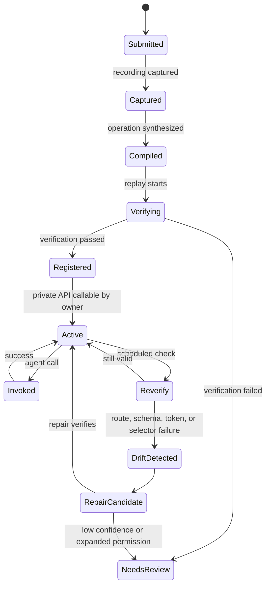
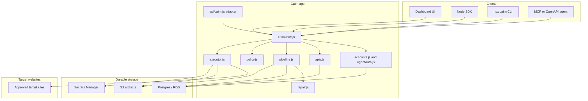

<a id="readme-top"></a>

<p align="center">
  <a href="https://github.com/arav31/Cairn-AI">
    
  </a>
</p>

<h1 align="center">Cairn</h1>

<p align="center">
  Record a browser workflow once, get a durable, private, reusable API you and your agents own and call forever.
  <br>
  <a href="#getting-started"><strong>Explore the docs &raquo;</strong></a>
  <br>
  <br>
  <a href="https://cairn-ai-gamma.vercel.app">Live App</a>
  &middot;
  <a href="https://cairn-ai-gamma.vercel.app/dashboard">View Demo</a>
  &middot;
  <a href="https://github.com/arav31/Cairn-AI/issues">Report Bug</a>
  &middot;
  <a href="https://github.com/arav31/Cairn-AI/issues">Request Feature</a>
</p>

<p align="center">
  <a href="https://github.com/arav31/Cairn-AI/graphs/contributors"></a>
  <a href="https://github.com/arav31/Cairn-AI/network/members"></a>
  <a href="https://github.com/arav31/Cairn-AI/stargazers"></a>
  <a href="https://github.com/arav31/Cairn-AI/issues"></a>
</p>

## Table Of Contents

1. [About The Project](#about-the-project)
   - [Built With](#built-with)
   - [How Cairn Works](#how-cairn-works)
   - [Architecture](#architecture)
   - [Auth Model](#auth-model)
2. [Getting Started](#getting-started)
   - [Prerequisites](#prerequisites)
   - [Installation](#installation)
   - [Configuration](#configuration)
3. [Usage](#usage)
   - [Run Locally](#run-locally)
   - [Install The Package](#install-the-package)
   - [SDK](#sdk)
   - [CLI](#cli)
   - [Agent Integration](#agent-integration)
   - [Submit A Workflow](#submit-a-workflow)
   - [Demo APIs](#demo-apis)
   - [Persistence](#persistence)
   - [AWS Setup](#aws-setup)
   - [Vercel Deployment](#vercel-deployment)
   - [Sandbox Targets](#sandbox-targets)
   - [Project Map](#project-map)
   - [Tests](#tests)
4. [Roadmap](#roadmap)
5. [Contributing](#contributing)
6. [License](#license)
7. [Contact](#contact)
8. [Acknowledgments](#acknowledgments)

## About The Project

Cairn turns slow browser workflows into private APIs. Useful work is often stuck behind a sequence of clicks: log in, pass an OTP, search, open a detail page, and copy out the answer. Cairn watches that workflow once, compiles the hidden multi-request backend flow, verifies it end to end, and exposes a typed API that belongs to the account that recorded it.

Every API Cairn creates is private to its owning account. There is no marketplace, public catalog, browsing of other people's APIs, payments, tokens, or credits. APIs are called with an account-scoped agent key, and one account cannot see or call another account's APIs.

Production URL used by the SDK and CLI by default:

```text
https://cairn-ai-gamma.vercel.app
```

Core invariants:

- Agents call typed contracts, not raw browser sessions.
- An operation must verify before it is registered as an API.
- Every API is private to its owning account. Cross-account lookups return `404`.
- Account-scoped agent keys are SHA-256 hashed before storage and the raw key is shown only once.
- Session secrets, CSRF tokens, cookies, and browser state stay outside agent-visible schemas.
- Invocation logs store hashes and metadata so usage is auditable without exposing full payloads by default.

<p align="right">(<a href="#readme-top">back to top</a>)</p>

### Built With

- [![Node.js][node-shield]][node-url]
- [![PostgreSQL][postgres-shield]][postgres-url]
- [![Vercel][vercel-shield]][vercel-url]
- [![AWS][aws-shield]][aws-url]
- [![OpenAPI][openapi-shield]][openapi-url]
- [![MCP][mcp-shield]][mcp-url]

<p align="right">(<a href="#readme-top">back to top</a>)</p>

### How Cairn Works

The lifecycle of one API:

1. **Record** - complete the task once in the browser while Cairn captures interactions and underlying network requests.
2. **Compile / synthesize** - turn the evidence into an operation definition: input schema, output schema, execution plan, fresh-token handling, selectors, allowed domains, success predicates, and OpenAPI.
3. **Verify end to end** - replay the operation against a known input and expected output before anything is registered.
4. **Register as a private API** - wrap the verified operation as a permissioned skill owned by your account, with a stable slug, schemas, README, and verification record.
5. **Invoke** - call the API with your agent key. Invocation is auth-gated and scope-checked; it is never payment-gated.
6. **Re-verify and repair on drift** - scheduled checks catch target-site changes. Repairs publish only after they verify; low-confidence repairs stay in human review.



The repair path exists in the codebase: `reverifyLatest` replays the operation, `repairLatest` re-verifies it, and `repairAndVerify` proposes a new operation version when drift is detected. A repaired version is registered only when verification passes.

<p align="right">(<a href="#readme-top">back to top</a>)</p>

### Architecture

Cairn runs locally as one small Node HTTP server (`src/server.js`) with no required external services. It already models the production boundaries: account identity, account-scoped agent keys, private API records, skill manifests, verification records, invocation logs, optional Postgres persistence, a Vercel adapter, and AWS artifact/worker infrastructure for the next phase.



Runtime responsibilities:

| Area | Files | Responsibility |
| --- | --- | --- |
| HTTP server | `src/server.js` | Routing, dashboard/static pages, JSON APIs, MCP surface, sandbox demo endpoints |
| Vercel adapter | `api/cairn.js`, `vercel.json` | Runs the same Node app as a Vercel Function |
| SDK and CLI | `src/sdk/client.js`, `bin/cairn.js` | Account creation, list/inspect/record/call private APIs, MCP |
| Accounts and auth | `src/cairn/accounts.js`, `src/cairn/agentAuth.js` | Account creation, agent key issuing, SHA-256 hashing, request authentication, account matching |
| Private APIs | `src/cairn/apis.js` | API record creation, owner-scoped lookup, OpenAPI generation, per-API README, demo workflows |
| Persistence | `src/cairn/database.js`, `migrations/*.sql` | Postgres pool, migrations, API loading, account/submission/invocation persistence |
| Pipeline | `src/cairn/pipeline.js` | Record, synthesize, verify, register, invoke, reverify, repair |
| Execution | `src/cairn/executor.js` | Input validation, deterministic replay, fixture execution, output matching, failure classification |
| Policy | `src/cairn/policy.js` | Skill creation, scope checks, input limits, invocation audit records |
| Synthesis and repair | `src/cairn/synthesizer.js`, `src/cairn/repair.js` | Recording-to-operation compiler, fresh-token lifting, drift classification, repaired operation proposals |
| AWS setup | `infra/aws/cloudshell-setup.sh`, `docs/AWS_STORAGE.md`, `docs/AWS_DATABASE.md` | RDS, S3, SQS, EventBridge, and Secrets Manager setup guidance |

<p align="right">(<a href="#readme-top">back to top</a>)</p>

### Auth Model

Every protected Cairn API is private to its owning account and gated by an account-scoped agent key.

1. Create or attach to an account with `POST /api/accounts`. For a new account, the response includes `agentAuth.agentKey` once. Cairn stores only a SHA-256 hash of it.
2. Store the raw key, for example as `CAIRN_AGENT_KEY`, and send it as `Authorization: Bearer <agentKey>` on protected calls.
3. The agent key resolves to exactly one account. Listing, inspecting, invoking, recording, usage, and MCP `tools/list` / `tools/call` only ever see that account's APIs.

Create or attach to an account:

```bash
curl -X POST http://localhost:3000/api/accounts \
  -H "Content-Type: application/json" \
  -d '{"accountId":"demo-user"}'
```

The response shape:

```json
{
  "account": { "id": "demo-user", "status": "active" },
  "agentAuth": {
    "type": "bearer",
    "header": "Authorization",
    "scheme": "Bearer",
    "agentKey": "cairn_agent_...",
    "note": "Store this key now. Cairn only returns the raw agent key once."
  },
  "next": {
    "listApis": "http://localhost:3000/api/apis",
    "recordWorkflow": "http://localhost:3000/api/workflows/recordings"
  }
}
```

If the account already exists, calling `POST /api/accounts` without a valid key returns `409 account_auth_required`. Re-send with the account's existing agent key.

<p align="right">(<a href="#readme-top">back to top</a>)</p>

## Getting Started

Follow these steps to run Cairn locally with in-memory state. Add `DATABASE_URL` later when you want durable state.

### Prerequisites

- Node.js `>=18`
- npm
- Optional: Postgres, only when using `DATABASE_URL`

### Installation

Clone the repository and install dependencies:

```bash
git clone https://github.com/arav31/Cairn-AI.git
cd Cairn-AI
npm install
```

### Configuration

Create a local environment file:

```bash
cp .env.example .env
```

Useful local defaults:

| Name | Required | Used for |
| --- | --- | --- |
| `PORT` | no | Local HTTP port. Defaults to `3000`. |
| `HOST` | no | Bind host. Defaults to `127.0.0.1`; use `0.0.0.0` in containers. |
| `CAIRN_PUBLIC_URL` | production | Public app URL used as the Vercel base URL fallback. |
| `CAIRN_ENABLE_DEMO_APIS` | no | Set to `true` to seed the three demo APIs owned by `demo-user`. |
| `CAIRN_BASE_URL` | optional | Base URL for the SDK/CLI. Defaults to production. |
| `CAIRN_ACCOUNT_ID` | optional | Default account id for the SDK/CLI. Defaults to `demo-user`. |
| `CAIRN_AGENT_KEY` | protected calls | Bearer key returned once by `POST /api/accounts`. |
| `DATABASE_URL` | production database | Postgres connection string for durable APIs, accounts, and logs. |
| `DATABASE_SSL` | production database | Set to `true` for RDS. Set to `false` only for trusted local Postgres. |
| `DATABASE_SSL_REJECT_UNAUTHORIZED` | optional | Set to `true` only when a trusted CA chain is configured. |
| `DATABASE_POOL_MAX` | optional | Postgres connection pool size. Defaults to `3`. |

AWS values for the next backend phase are documented in `.env.example`, `docs/AWS_STORAGE.md`, and `docs/AWS_DATABASE.md`.

<p align="right">(<a href="#readme-top">back to top</a>)</p>

## Usage

### Run Locally

Start the app:

```bash
npm start
```

Open the dashboard and demo UI:

```text
http://localhost:3000
http://localhost:3000/dashboard
```

If port `3000` is busy:

```bash
PORT=3005 npm start
```

To explore with the three deterministic demo APIs pre-loaded:

```bash
CAIRN_ENABLE_DEMO_APIS=true npm start
```

Run the test suite:

```bash
npm test
```

<p align="right">(<a href="#readme-top">back to top</a>)</p>

### Install The Package

The package is not published to npm yet. Install it from GitHub:

```bash
npm install github:arav31/Cairn-AI
```

The SDK and CLI call your own private APIs. Create an account once to get an agent key, then list, inspect, record, and call the APIs that belong to that account. There are no credits or payments.

<p align="right">(<a href="#readme-top">back to top</a>)</p>

### SDK

```js
const { CairnClient } = require("cairn");

const cairn = new CairnClient({
  baseUrl: "https://cairn-ai-gamma.vercel.app",
  accountId: "demo-user",
  agentKey: process.env.CAIRN_AGENT_KEY
});

// Create the account once and capture the agent key, returned only once.
const account = await cairn.createAccount();
process.env.CAIRN_AGENT_KEY ||= account.agentAuth.agentKey;

// List the APIs that belong to your account.
const { apis } = await cairn.listApis();

// Call one of your APIs. Auth-gated, never payment-gated.
const result = await cairn.invoke("demo-user/compareInsurancePrices", {
  input: {
    coverageType: "auto",
    zipCode: "78701",
    driverAge: 35,
    vehicleYear: 2021
  }
});
```

SDK surface:

| Method | Description |
| --- | --- |
| `createAccount(accountId?)` | Create or attach to an account; captures `agentAuth.agentKey`. |
| `listApis()` | List the APIs owned by your account. |
| `getApi(slug)` | Inspect one API: contract, operation, verification. |
| `apiReadme(slug)` | Markdown README for one API. |
| `apiOpenApi(slug)` | OpenAPI document for one API. |
| `recordWorkflow({ title, targetUrl, goal })` | Submit a workflow recording to be compiled into a private API. |
| `invoke(slug, { input })` | Call one of your APIs. |
| `mcpToolList()` | MCP `tools/list` over your APIs. |
| `mcpCall(name, args)` | MCP `tools/call` for one of your APIs. |
| `discovery()` | Fetch `/.well-known/cairn.json`. |

Default base URL is `https://cairn-ai-gamma.vercel.app`. The SDK reads `CAIRN_BASE_URL`, `CAIRN_ACCOUNT_ID`, and `CAIRN_AGENT_KEY` from the environment when options are not passed.

<p align="right">(<a href="#readme-top">back to top</a>)</p>

### CLI

The CLI (`bin/cairn.js`) wraps the SDK. `CAIRN_AGENT_KEY` is sent as the bearer key; every API is private to your account.

```bash
# Create an account, print the agent key once, or re-attach to it.
npx cairn account create --account demo-user
npx cairn login --account demo-user

# List the APIs that belong to your account.
npx cairn apis

# Submit a workflow recording for compilation.
npx cairn record --title "Compare civic records" --url http://localhost:3000/civic --goal "Return record status"

# Call one of your APIs.
npx cairn call --api demo-user/compareInsurancePrices --input '{"coverageType":"auto","zipCode":"78701"}'

# Inspect docs for one API.
npx cairn readme --api demo-user/searchProperties
npx cairn openapi --api demo-user/searchProperties

# MCP.
npx cairn mcp list
npx cairn mcp call --api compareInsurancePrices --input '{"coverageType":"auto","zipCode":"78701"}'
```

Defaults: `--base-url https://cairn-ai-gamma.vercel.app`, `--account demo-user`.

<p align="right">(<a href="#readme-top">back to top</a>)</p>

### Agent Integration

Discovery endpoints:

```http
GET /.well-known/cairn.json
GET /openapi.json
GET /api/state
```

Your APIs require a matching agent bearer key:

```http
GET  /api/apis
GET  /api/apis/:slug
GET  /api/accounts/:id/usage
```

Per-API documents require a matching agent bearer key:

```http
GET  /api/tools/:slug/openapi.json
GET  /api/tools/:slug/readme.md
GET  /api/tools/:slug/verification
GET  /api/tools/:slug
POST /api/tools/:slug/invoke
```

Accounts, recording, MCP, and skill-level invoke:

```http
POST /api/accounts
POST /api/workflows/recordings
POST /mcp
POST /api/invoke
```

There are intentionally no catalog, public tool list, integrations, token, payment, or Stripe webhook routes. Cross-account requests to protected routes return `404`.

Invoke an API:

```bash
curl -X POST http://localhost:3000/api/tools/demo-user/compareInsurancePrices/invoke \
  -H "Authorization: Bearer $CAIRN_AGENT_KEY" \
  -H "Content-Type: application/json" \
  -d '{
    "input": {
      "coverageType": "auto",
      "zipCode": "78701",
      "driverAge": 35,
      "vehicleYear": 2021
    }
  }'
```

Request body: `{ input, caller? }`. Response shape:

```json
{
  "apiId": "demo-user/compareInsurancePrices",
  "result": {
    "allowed": true,
    "output": {}
  }
}
```

If policy blocks the call, `result.allowed` is `false` and the HTTP status is `403`. If execution fails after passing policy, the response carries `result.error`.

MCP list:

```bash
curl -X POST http://localhost:3000/mcp \
  -H "Authorization: Bearer $CAIRN_AGENT_KEY" \
  -H "Content-Type: application/json" \
  -d '{ "jsonrpc": "2.0", "id": "tools", "method": "tools/list" }'
```

MCP call:

```bash
curl -X POST http://localhost:3000/mcp \
  -H "Authorization: Bearer $CAIRN_AGENT_KEY" \
  -H "Content-Type: application/json" \
  -d '{
    "jsonrpc": "2.0",
    "id": "call-1",
    "method": "tools/call",
    "params": {
      "name": "compareInsurancePrices",
      "arguments": { "coverageType": "auto", "zipCode": "78701" }
    }
  }'
```

`initialize` does not require auth; `tools/list` and `tools/call` do, and they only ever see APIs owned by the authenticated account.

<p align="right">(<a href="#readme-top">back to top</a>)</p>

### Submit A Workflow

Submitting a recording is how a workflow becomes a private API. The endpoint accepts the upload today; wiring real artifact capture and synthesis to it is the next recorder/compiler step.

```http
POST /api/workflows/recordings
```

```json
{
  "title": "Compare flight refund options",
  "targetUrl": "http://localhost:3000/civic",
  "goal": "Return refund eligibility, policy notes, and next available action.",
  "artifacts": []
}
```

It responds `202` with an accepted submission id. The submission is owned by the authenticated account.

<p align="right">(<a href="#readme-top">back to top</a>)</p>

### Demo APIs

Three deterministic demo APIs are available for local exploration and tests. They run via fixtures, no live sandbox needed, and are opt-in. They are owned by a `demo-user` account.

Enable them with an environment variable:

```bash
CAIRN_ENABLE_DEMO_APIS=true npm start
```

Or when embedding the app:

```js
const { createApp } = require("cairn/server");
const app = createApp({ seedDemoApis: true });
```

Seeded APIs:

| API | Slug | Input required |
| --- | --- | --- |
| Compare Insurance Prices | `demo-user/compareInsurancePrices` | `zipCode` |
| Search Properties | `demo-user/searchProperties` | `location` |
| Business Renewals | `demo-user/checkBusinessRenewals` | `businessName`, `state` |

When `DATABASE_URL` is set, demo APIs are only seeded if no stored APIs are loaded and demo seeding is enabled, so a configured database is not polluted by accident.

<p align="right">(<a href="#readme-top">back to top</a>)</p>

### Persistence

Local runs work without a database: APIs, accounts, agent keys, submissions, and logs live in process memory and are lost on restart.

For durable state, set `DATABASE_URL` and run the migrations:

```bash
npm run db:migrate
```

Migrations apply in order: `001_initial_schema.sql` then `002_private_apis_no_payments.sql`. Migration `002` drops credit/payment tables, renames `marketplace_listings` to `apis` with an `owner_account_id` and no pricing columns, and renames the invocation audit column `listing_slug` to `api_slug`.

Tables after both migrations:

| Table | What it stores |
| --- | --- |
| `accounts` | Account identity: id, status, metadata. |
| `agent_api_keys` | Account-scoped agent keys: SHA-256 hash, prefix, label, status. |
| `api_operations` | Full operation definition: schemas, execution plan, OpenAPI, selectors, success predicates. |
| `skill_manifests` | Permissioned skill wrapper: owner, scopes, risk tier, version pointers. |
| `apis` | Private API record: slug, owner account, visibility, quality gate, verification freshness, contract. |
| `verification_records` | Verification history used to check whether an API version still works. |
| `workflow_submissions` | Recording submissions by account. |
| `invocation_logs` | Policy decision, input/output hashes, status, caller account, and API slug. |

On boot with `DATABASE_URL` set, Cairn reloads APIs from Postgres so they can be listed, inspected, invoked, and re-verified after a restart.

<p align="right">(<a href="#readme-top">back to top</a>)</p>

### AWS Setup

AWS is for the next phase: storing recordings, traces, and artifacts in S3, then running synthesis, verification, and repair as workers. The current app does not require AWS.

The helper script is:

```bash
infra/aws/cloudshell-setup.sh
```

Run it from AWS CloudShell after cloning the repo:

```bash
rm -rf Cairn-AI
git clone https://github.com/arav31/Cairn-AI.git
cd Cairn-AI
bash infra/aws/cloudshell-setup.sh
set -a
. ./cairn-prod.env
set +a
npm install
npm run db:migrate
```

The script writes `cairn-prod.env` with `DATABASE_URL`, RDS settings, SQS queue URLs, `EVENTBRIDGE_BUS_NAME`, and `SECRETS_PREFIX`. After AWS creates it, sync the non-empty values to Vercel and redeploy. See `docs/AWS_STORAGE.md` and `docs/AWS_DATABASE.md` for details.

<p align="right">(<a href="#readme-top">back to top</a>)</p>

### Vercel Deployment

The app runs locally as a plain Node HTTP server. On Vercel, `api/cairn.js` adapts the same server to a Vercel Function and `vercel.json` rewrites routes into it.

```bash
npx vercel@latest deploy --prod --force --scope trend-pact
```

Current production project:

```text
trend-pact/cairn-ai
https://cairn-ai-gamma.vercel.app
```

<p align="right">(<a href="#readme-top">back to top</a>)</p>

### Sandbox Targets

These exist for recorder/compiler/repair testing. They are not seeded as APIs.

- `/meridian` - modern JSON REST CRM sandbox: login, OTP, search, detail.
- `/civic` - legacy server-rendered records portal with CSRF and ViewState-style hidden state.

Demo recorder, verify, and repair endpoints drive the lifecycle against those sandboxes:

```http
POST /api/demo/record
POST /api/demo/reverify
POST /api/demo/repair
POST /api/demo/drift-civic
POST /api/demo/reset-drift
```

A typical durability demo: `record` the civic workflow, `drift-civic` to move a route, `reverify` to watch it fail, then `repair` to publish a verified new version.

<p align="right">(<a href="#readme-top">back to top</a>)</p>

### Project Map

```text
bin/cairn.js               CLI: account, apis, record, call, readme, openapi, mcp
src/sdk/client.js          Installable Node SDK

public/                    Dashboard + demo UI assets
public/styles.css          Shared styling

api/cairn.js               Vercel Function adapter
vercel.json                Vercel rewrites and function config
src/server.js              HTTP server, routes, dashboard, MCP surface, sandbox endpoints
src/cairn/accounts.js      Account normalization and durable account creation
src/cairn/agentAuth.js     Agent key issuing, hashing, request authentication, account matching
src/cairn/apis.js          Private API records, owner-scoped lookup, OpenAPI, README, demo workflows
src/cairn/database.js      Postgres pool, migrations, API/account/submission/invocation persistence
src/cairn/pipeline.js      Record/synthesize/verify/register, invocation, reverify, repair
src/cairn/executor.js      Deterministic workflow execution and output matching
src/cairn/policy.js        Skill creation, scope checks, invocation logs
src/cairn/synthesizer.js   Recording-to-operation compiler
src/cairn/repair.js        Drift classification and repair proposals
src/data/seed.js           Synthetic CRM, civic, insurance, and property data

migrations/001_initial_schema.sql            Base schema
migrations/002_private_apis_no_payments.sql  Drop payments, private per-account apis table
tests/*.test.js                              Node test runner coverage
```

<p align="right">(<a href="#readme-top">back to top</a>)</p>

### Tests

```bash
npm test
```

Run tests with and without `DATABASE_URL`; the in-memory path keeps local runs fast and the persistent path exercises migrations and durable reload.

<p align="right">(<a href="#readme-top">back to top</a>)</p>

## Roadmap

The product foundation - record, verify, register a private API, invoke, re-verify, repair - is in place. The forward plan focuses on durability and ownership, not payments or a marketplace.

- Scheduled re-verification for every registered API, with health signals from pass rate, latency, and freshness.
- Repair proposals backed by trace diffs and confidence scores; auto-publish only safe route/selector fixes after verification.
- Rollback to the last verified operation version, and alerts on repeated drift.
- Team/tenant ownership for APIs, agent keys, and submissions, so a team can share private APIs without exposing them publicly.
- Per-API rate limits, scopes, risk tiers, and domain allowlists.
- OAuth/OIDC for enterprise agent runtimes; audit exports for compliance.
- Connect the browser recorder/compiler output to `POST /api/workflows/recordings`.
- Store recording bundles, traces, and generated artifacts in S3; resolve secrets only inside workers and redact traces before any LLM-assisted repair.
- Move synthesis, verification, and repair onto workers so long jobs stay off the request path.
- Publish the SDK under a real npm package name.
- Generate typed clients from per-API OpenAPI schemas.
- Add a hosted MCP configuration page for common agent clients, plus examples for ChatGPT Actions, Cursor, n8n, and direct REST.

See the [open issues](https://github.com/arav31/Cairn-AI/issues) for proposed features and known issues.

<p align="right">(<a href="#readme-top">back to top</a>)</p>

## Contributing

Contributions are welcome when they preserve Cairn's account-scoped privacy model and keep APIs auth-gated, not payment-gated.

1. Fork the project.
2. Create your feature branch: `git checkout -b feature/my-change`.
3. Commit your changes: `git commit -m "Describe the change"`.
4. Push to the branch: `git push origin feature/my-change`.
5. Open a pull request.

For bugs and feature requests, use [GitHub Issues](https://github.com/arav31/Cairn-AI/issues).

<p align="right">(<a href="#readme-top">back to top</a>)</p>

## License

The root project currently has no declared license file. Do not assume MIT, Apache, or any other open-source license applies to the repository root until a root license is added.

Nested packages may have their own licenses; check the relevant subdirectory before reusing code from them.

<p align="right">(<a href="#readme-top">back to top</a>)</p>

## Contact

Project link: [https://github.com/arav31/Cairn-AI](https://github.com/arav31/Cairn-AI)

Issues and feature requests: [https://github.com/arav31/Cairn-AI/issues](https://github.com/arav31/Cairn-AI/issues)

<p align="right">(<a href="#readme-top">back to top</a>)</p>

## Acknowledgments

- [othneildrew/Best-README-Template](https://github.com/othneildrew/Best-README-Template) for the README structure.
- [Model Context Protocol](https://modelcontextprotocol.io/) for the agent tool interface shape.
- [OpenAPI](https://www.openapis.org/) for API contract documentation.
- [Node.js](https://nodejs.org/), [PostgreSQL](https://www.postgresql.org/), [Vercel](https://vercel.com/), and [AWS](https://aws.amazon.com/) for the runtime and deployment stack.

<p align="right">(<a href="#readme-top">back to top</a>)</p>

[node-shield]: https://img.shields.io/badge/Node.js-339933?style=for-the-badge&logo=nodedotjs&logoColor=white
[node-url]: https://nodejs.org/
[postgres-shield]: https://img.shields.io/badge/PostgreSQL-4169E1?style=for-the-badge&logo=postgresql&logoColor=white
[postgres-url]: https://www.postgresql.org/
[vercel-shield]: https://img.shields.io/badge/Vercel-000000?style=for-the-badge&logo=vercel&logoColor=white
[vercel-url]: https://vercel.com/
[aws-shield]: https://img.shields.io/badge/AWS-232F3E?style=for-the-badge&logo=amazonwebservices&logoColor=white
[aws-url]: https://aws.amazon.com/
[openapi-shield]: https://img.shields.io/badge/OpenAPI-6BA539?style=for-the-badge&logo=openapiinitiative&logoColor=white
[openapi-url]: https://www.openapis.org/
[mcp-shield]: https://img.shields.io/badge/MCP-111827?style=for-the-badge
[mcp-url]: https://modelcontextprotocol.io/
