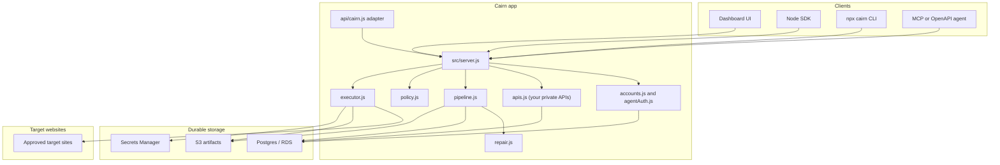
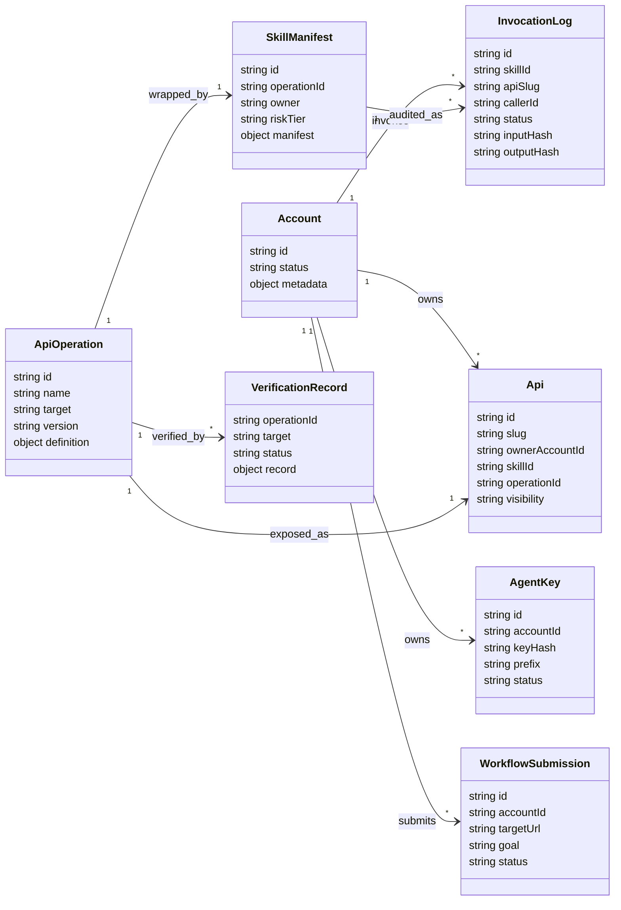
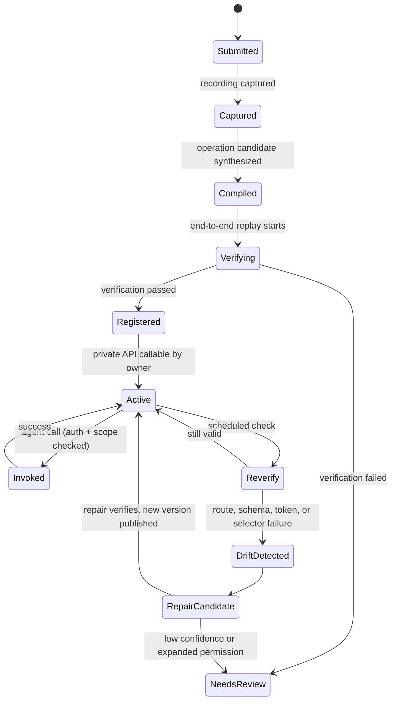

# Cairn

**Record a browser workflow once, get a durable, private, reusable API you and your agents own and call forever.**

Useful work is often stuck behind a slow browser workflow: log in, pass an OTP, search, click through a few pages, copy out the answer. Cairn watches you do that task once, compiles the hidden multi-request backend flow, verifies it end to end, and turns it into a typed API that lives in your account. After that, you and your own agents call a single endpoint instead of clicking through the site again.

**Record once. Reuse forever.**

Every API Cairn creates is **private** to the account that owns it. There is no marketplace, no public catalog, no browsing or discovery of other people's APIs, and no payments, tokens, or credits. APIs are called with an account-scoped agent key, and one account can never see or call another account's APIs. When a target site changes and an API drifts, Cairn re-verifies it and repairs it.

Production URL used by the SDK and CLI by default:

```text
https://cairn-ai-gamma.vercel.app
```

## What It Is

- A tool that turns a recorded browser workflow into a durable, private, reusable API owned by your account.
- A package, SDK, and CLI you or your agents install to list, inspect, record, and call those APIs.
- Account-scoped agent keys: created once, hashed at rest, sent as `Authorization: Bearer <agentKey>`.
- Auth-gated invocation only — never payment-gated. No tokens, wallets, credits, or Stripe.
- Per-API README, OpenAPI, MCP tool, and verification endpoints, all scoped to the calling account.
- A durability story: scheduled re-verification detects drift, and repair proposes a new operation version that publishes only after it verifies.
- Optional Postgres persistence when `DATABASE_URL` is configured, so your APIs, accounts, agent keys, verification history, submissions, and invocation logs survive restarts.

## How Cairn Works

The lifecycle of one API:

1. **Record** — you complete the task once in the browser; Cairn captures the interactions and the underlying network requests.
2. **Compile / synthesize** — the compiler turns that evidence into an operation definition: input schema, output schema, execution plan, fresh-token handling, selectors, allowed domains, success predicates, and OpenAPI.
3. **Verify end to end** — Cairn replays the operation against a known input and expected output before anything is registered.
4. **Register as a private API** — a verified operation is wrapped as a permissioned skill and registered as an API **owned by your account**, with a stable slug, schemas, README, and verification record.
5. **Invoke** — you and your agents call the API with your agent key. Invocation is auth-gated and scope-checked; it is never payment-gated.
6. **Re-verify + repair on drift** — scheduled re-verification catches changes in the target site. If the operation breaks, repair proposes a new version and publishes it only after it verifies; low-confidence repairs are left for a human.

Core invariants:

- Agents call typed contracts, not raw browser sessions.
- Every API points to a versioned operation, a skill manifest, and a verification record.
- An operation must verify before it is registered as an API.
- Every API is private to its owning account. Cross-account lookups return `404` — you cannot even probe another account's API names.
- Account-scoped agent keys are SHA-256 hashed before storage and the raw key is shown only once.
- Session secrets, CSRF tokens, cookies, and browser state stay outside agent-visible schemas.
- Invocation logs store hashes and metadata so usage is auditable without exposing full payloads by default.

## Architecture

The whole thing runs locally as one small Node HTTP server (`src/server.js`), with no required external services. It already models the production boundaries: account identity, account-scoped agent keys, private API records, skill manifests, verification records, invocation logs, optional Postgres persistence, a Vercel adapter, and AWS artifact/worker infrastructure for the next phase.



The local app runs without Postgres or AWS; in that mode all state is held in memory and is ephemeral. Production should set `DATABASE_URL`, run migrations, store artifacts in S3, and sync AWS environment values to Vercel.

### Runtime responsibilities

| Area | Files | Responsibility |
| --- | --- | --- |
| HTTP server | `src/server.js` | Routing, dashboard/static pages, JSON APIs, MCP surface, sandbox demo endpoints |
| Vercel adapter | `api/cairn.js`, `vercel.json` | Runs the same Node app as a Vercel Function |
| SDK and CLI | `src/sdk/client.js`, `bin/cairn.js` | Account creation, list/inspect/record/call your private APIs, MCP |
| Accounts and auth | `src/cairn/accounts.js`, `src/cairn/agentAuth.js` | Account creation, agent key issuing, SHA-256 hashing, request authentication, account matching |
| Private APIs | `src/cairn/apis.js` | API record creation, owner-scoped lookup, OpenAPI generation, per-API README, demo workflows |
| Persistence | `src/cairn/database.js`, `migrations/*.sql` | Postgres pool, migrations, API loading, account/submission/invocation persistence |
| Pipeline | `src/cairn/pipeline.js` | Record → synthesize → verify → register, invocation, reverify, repair |
| Execution | `src/cairn/executor.js` | Input validation, deterministic replay, fixture execution, output matching, failure classification |
| Policy | `src/cairn/policy.js` | Skill creation, scope checks, input limits, invocation audit records |
| Synthesis and repair | `src/cairn/synthesizer.js`, `src/cairn/repair.js` | Recording-to-operation compiler, fresh-token lifting, drift classification, repaired operation proposals |
| AWS setup | `infra/aws/cloudshell-setup.sh`, `docs/AWS_STORAGE.md`, `docs/AWS_DATABASE.md` | RDS, S3, SQS, EventBridge, and Secrets Manager setup guidance |

## Domain Model



## Record, Verify, Repair Lifecycle



The repair path is real in the codebase: `reverifyLatest` replays the operation, `repairLatest` re-verifies and, on failure, asks `repairAndVerify` for a proposed new operation version. A repaired version is registered (new version, new verification record, re-owned by the same account) only when it verifies; otherwise the job is marked `needs_human`.

## Auth Model

Every protected Cairn API is private to its owning account and gated by an account-scoped agent key.

1. Create (or attach to) an account with `POST /api/accounts`. For a brand-new account, the response includes `agentAuth.agentKey` **once**. Cairn stores only a SHA-256 hash of it.
2. Store the raw key (for example as `CAIRN_AGENT_KEY`) and send it as `Authorization: Bearer <agentKey>` on every protected call.
3. The agent key resolves to exactly one account. Listing, inspecting, invoking, recording, usage, and MCP `tools/list` / `tools/call` only ever see that account's APIs. A request for another account returns `404` (or `403 agent_account_mismatch` when an explicit account id conflicts with the key).

Create or attach to an account:

```bash
curl -X POST http://localhost:3000/api/accounts \
  -H "Content-Type: application/json" \
  -d '{"accountId":"demo-user"}'
```

The response shape:

```json
{
  "account": { "id": "demo-user", "status": "active" },
  "agentAuth": {
    "type": "bearer",
    "header": "Authorization",
    "scheme": "Bearer",
    "agentKey": "cairn_agent_…",
    "note": "Store this key now. Cairn only returns the raw agent key once."
  },
  "next": {
    "listApis": "http://localhost:3000/api/apis",
    "recordWorkflow": "http://localhost:3000/api/workflows/recordings"
  }
}
```

> If the account already exists, calling `POST /api/accounts` without a valid key returns `409 account_auth_required`. Re-send with the account's existing agent key.

## Quickstart

Install dependencies:

```bash
npm install
```

Create a local env file:

```bash
cp .env.example .env
```

Start the app:

```bash
npm start
```

Open the dashboard and demo UI:

```text
http://localhost:3000
http://localhost:3000/dashboard
```

If port `3000` is busy:

```bash
PORT=3005 npm start
```

Run tests:

```bash
npm test
```

To explore with the three deterministic demo APIs (owned by `demo-user`) pre-loaded:

```bash
CAIRN_ENABLE_DEMO_APIS=true npm start
```

## Install The Package

The package is not published to npm yet. Install it from GitHub:

```bash
npm install github:arav31/Cairn-AI
```

Use the SDK (`src/sdk/client.js`). It calls your own private APIs — create an account once to get an agent key, then list, inspect, record, and call the APIs that belong to that account. There are no credits or payments.

```js
const { CairnClient } = require("cairn");

const cairn = new CairnClient({
  baseUrl: "https://cairn-ai-gamma.vercel.app",
  accountId: "demo-user",
  agentKey: process.env.CAIRN_AGENT_KEY
});

// Create the account once and capture the agent key (returned only once).
const account = await cairn.createAccount();
process.env.CAIRN_AGENT_KEY ||= account.agentAuth.agentKey;

// List the APIs that belong to your account.
const { apis } = await cairn.listApis();

// Call one of your APIs. Auth-gated, never payment-gated.
const result = await cairn.invoke("demo-user/compareInsurancePrices", {
  input: {
    coverageType: "auto",
    zipCode: "78701",
    driverAge: 35,
    vehicleYear: 2021
  }
});
```

SDK surface:

| Method | Description |
| --- | --- |
| `createAccount(accountId?)` | Create or attach to an account; captures `agentAuth.agentKey`. |
| `listApis()` | List the APIs owned by your account. |
| `getApi(slug)` | Inspect one API: contract, operation, verification. |
| `apiReadme(slug)` | Markdown README for one API. |
| `apiOpenApi(slug)` | OpenAPI document for one API. |
| `recordWorkflow({ title, targetUrl, goal })` | Submit a workflow recording to be compiled into a private API. |
| `invoke(slug, { input })` | Call one of your APIs (no payment). |
| `mcpToolList()` | MCP `tools/list` over your APIs. |
| `mcpCall(name, args)` | MCP `tools/call` for one of your APIs. |
| `discovery()` | Fetch `/.well-known/cairn.json`. |

Default base URL is `https://cairn-ai-gamma.vercel.app`. The SDK reads `CAIRN_BASE_URL`, `CAIRN_ACCOUNT_ID`, and `CAIRN_AGENT_KEY` from the environment when options are not passed.

## CLI

The CLI (`bin/cairn.js`) wraps the SDK. `CAIRN_AGENT_KEY` is sent as the bearer key; every API is private to your account.

```bash
# Create an account (prints the agent key once) or re-attach to it
npx cairn account create --account demo-user
npx cairn login --account demo-user

# List the APIs that belong to your account
npx cairn apis

# Submit a workflow recording for compilation
npx cairn record --title "Compare flight refunds" --url https://example.com/trips --goal "Return refund eligibility"

# Call one of your APIs
npx cairn call --api demo-user/compareInsurancePrices --input '{"coverageType":"auto","zipCode":"78701"}'

# Inspect docs for one API
npx cairn readme --api demo-user/searchProperties
npx cairn openapi --api demo-user/searchProperties

# MCP
npx cairn mcp list
npx cairn mcp call --api compareInsurancePrices --input '{"coverageType":"auto","zipCode":"78701"}'
```

Defaults: `--base-url https://cairn-ai-gamma.vercel.app`, `--account demo-user`.

## Agent Integration

### Endpoints

Discovery (open):

```http
GET /.well-known/cairn.json
GET /openapi.json            # auth-scoped: paths cover only your APIs
GET /api/state               # local demo/inspection state
```

Your APIs (require a matching agent bearer key):

```http
GET  /api/apis               # list your APIs
GET  /api/apis/:slug         # inspect one API + operation + verification
GET  /api/accounts/:id/usage # your usage (invocation logs, submissions)
```

Per-API documents (require a matching agent bearer key):

```http
GET  /api/tools/:slug/openapi.json
GET  /api/tools/:slug/readme.md
GET  /api/tools/:slug/verification
GET  /api/tools/:slug                 # summary + verification
POST /api/tools/:slug/invoke          # call the API
```

Accounts and recording:

```http
POST /api/accounts                    # create/attach; returns agentKey once
POST /api/workflows/recordings        # submit a recording (requires key)
```

MCP (single JSON-RPC endpoint):

```http
POST /mcp                             # initialize | tools/list | tools/call
```

Skill-level invoke (requires key; resolves your own skill):

```http
POST /api/invoke                      # { skillId, input, caller? }
```

> There are intentionally no catalog, public tool list, integrations, token, payment, or Stripe webhook routes. Cross-account requests to any of the protected routes return `404`.

### Invoking an API

Invocation is auth-gated and scope-checked only — there is no quote, checkout, or credit step.

```bash
curl -X POST http://localhost:3000/api/tools/demo-user/compareInsurancePrices/invoke \
  -H "Authorization: Bearer $CAIRN_AGENT_KEY" \
  -H "Content-Type: application/json" \
  -d '{
    "input": {
      "coverageType": "auto",
      "zipCode": "78701",
      "driverAge": 35,
      "vehicleYear": 2021
    }
  }'
```

Request body: `{ input, caller? }`. Response shape:

```json
{
  "apiId": "demo-user/compareInsurancePrices",
  "result": {
    "allowed": true,
    "output": { }
  }
}
```

If policy blocks the call, `result.allowed` is `false` and the HTTP status is `403`. If execution fails after passing policy, the response carries `result.error`.

### MCP

List your tools:

```bash
curl -X POST http://localhost:3000/mcp \
  -H "Authorization: Bearer $CAIRN_AGENT_KEY" \
  -H "Content-Type: application/json" \
  -d '{ "jsonrpc": "2.0", "id": "tools", "method": "tools/list" }'
```

Call a tool:

```bash
curl -X POST http://localhost:3000/mcp \
  -H "Authorization: Bearer $CAIRN_AGENT_KEY" \
  -H "Content-Type: application/json" \
  -d '{
    "jsonrpc": "2.0",
    "id": "call-1",
    "method": "tools/call",
    "params": {
      "name": "compareInsurancePrices",
      "arguments": { "coverageType": "auto", "zipCode": "78701" }
    }
  }'
```

`initialize` does not require auth; `tools/list` and `tools/call` do, and they only ever see the APIs owned by the authenticated account.

## Submit A Workflow

Submitting a recording is how a workflow becomes a private API. The endpoint accepts the upload today; wiring real artifact capture and synthesis to it is the next recorder/compiler step.

```http
POST /api/workflows/recordings
```

```json
{
  "title": "Compare flight refund options",
  "targetUrl": "https://example.com/account/trips",
  "goal": "Return refund eligibility, policy notes, and next available action.",
  "artifacts": []
}
```

It responds `202` with an accepted submission id. The submission is owned by the authenticated account.

## Demo APIs

Three deterministic demo APIs are available for local exploration and tests. They run via fixtures (no live sandbox needed) and are **opt-in** — they are not supply for anyone else and are owned by a `demo-user` account.

Enable them with an environment variable:

```bash
CAIRN_ENABLE_DEMO_APIS=true npm start
```

…or when embedding the app:

```js
const { createApp } = require("cairn/server");
const app = createApp({ seedDemoApis: true });
```

The seeded APIs (slugs are `owner/operationName`):

| API | Slug | Input (required) |
| --- | --- | --- |
| Compare Insurance Prices | `demo-user/compareInsurancePrices` | `zipCode` |
| Search Properties | `demo-user/searchProperties` | `location` |
| Business Renewals | `demo-user/checkBusinessRenewals` | `businessName`, `state` |

When `DATABASE_URL` is set, demo APIs are only seeded if no stored APIs are loaded and demo seeding is enabled, so a configured database is never polluted by accident.

## Persistence Model

Local runs work without a database: APIs, accounts, agent keys, submissions, and logs live in process memory and are lost on restart.

For durable state, set `DATABASE_URL` and run the migrations:

```bash
npm run db:migrate
```

Migrations apply in order: `001_initial_schema.sql` then `002_private_apis_no_payments.sql`. Migration `002` is the repositioning: it **drops** every credit/payment table (`token_wallets`, `token_ledger`, `usage_events`, `payments`), renames `marketplace_listings` to `apis` with an `owner_account_id` and no pricing columns, and renames the invocation audit column `listing_slug` to `api_slug`.

Tables after both migrations:

| Table | What it stores |
| --- | --- |
| `accounts` | Account identity (id, status, metadata). |
| `agent_api_keys` | Account-scoped agent keys (SHA-256 hash, prefix, label, status). |
| `api_operations` | Full operation definition: schemas, execution plan, OpenAPI, selectors, success predicates. |
| `skill_manifests` | Permissioned skill wrapper: owner, scopes, risk tier, version pointers. |
| `apis` | Your private API record: slug, owner account, visibility, quality gate, verification freshness, contract. |
| `verification_records` | Verification history used to check whether an API version still works. |
| `workflow_submissions` | Recording submissions by account. |
| `invocation_logs` | Policy decision, input/output hashes, status, caller account, and API slug. |

On boot with `DATABASE_URL` set, Cairn reloads your APIs from Postgres so they can be listed, inspected, invoked, and re-verified after a restart.

## AWS Setup

AWS is still relevant for the next phase: storing recordings/traces/artifacts in S3 and running synthesis, verification, and repair as workers. The current app does not require these yet.

The helper script is:

```bash
infra/aws/cloudshell-setup.sh
```

Run it from AWS CloudShell after cloning the repo:

```bash
rm -rf Cairn-AI
git clone https://github.com/arav31/Cairn-AI.git
cd Cairn-AI
bash infra/aws/cloudshell-setup.sh
set -a
. ./cairn-prod.env
set +a
npm install
npm run db:migrate
```

The script writes `cairn-prod.env` with `DATABASE_URL`, RDS settings, SQS queue URLs, `EVENTBRIDGE_BUS_NAME`, and `SECRETS_PREFIX`. After AWS creates it, sync the non-empty values to Vercel and redeploy. See `docs/AWS_STORAGE.md` and `docs/AWS_DATABASE.md` for details.

## Vercel Deployment

The app runs locally as a plain Node HTTP server. On Vercel, `api/cairn.js` adapts the same server to a Vercel Function and `vercel.json` rewrites routes into it.

```bash
npx vercel@latest deploy --prod --force --scope trend-pact
```

Current production project:

```text
trend-pact/cairn-ai
https://cairn-ai-gamma.vercel.app
```

## Environment Variables

Server:

| Name | Required | Used for |
| --- | --- | --- |
| `PORT` | no | Local HTTP port. Defaults to `3000`. |
| `HOST` | no | Bind host. Defaults to `127.0.0.1`; use `0.0.0.0` in containers. |
| `CAIRN_PUBLIC_URL` | production | Public app URL used as the Vercel base URL fallback. |
| `CAIRN_ENABLE_DEMO_APIS` | no | Set to `true` to seed the three demo APIs (owned by `demo-user`). |

SDK / CLI:

| Name | Required | Used for |
| --- | --- | --- |
| `CAIRN_BASE_URL` | optional | Base URL for the SDK/CLI. Defaults to production. |
| `CAIRN_ACCOUNT_ID` | optional | Default account id for the SDK/CLI. Defaults to `demo-user`. |
| `CAIRN_AGENT_KEY` | protected calls | Bearer key returned once by `POST /api/accounts`. Required to list, inspect, record, invoke, read usage, and use MCP `tools/list` / `tools/call`. |

Database:

| Name | Required | Used for |
| --- | --- | --- |
| `DATABASE_URL` | production database | RDS/Postgres connection string. Enables durable APIs, accounts, and logs. |
| `DATABASE_SSL` | production database | Set to `true` for RDS. Set to `false` only for trusted local Postgres. |
| `DATABASE_SSL_REJECT_UNAUTHORIZED` | optional | Set to `true` only when a trusted CA chain is configured. |
| `DATABASE_POOL_MAX` | optional | Postgres connection pool size. Defaults to `3`. |

AWS (for the next backend phase; not read by the current demo):

| Name | Used for |
| --- | --- |
| `AWS_REGION` | AWS SDK region. |
| `AWS_ACCOUNT_ID` | AWS account id. |
| `RDS_DB_INSTANCE_IDENTIFIER` | RDS instance name for setup scripts. |
| `RDS_DB_NAME` | Postgres database name. |
| `RDS_MASTER_USERNAME` | Postgres admin username. |
| `S3_RECORDINGS_BUCKET` | Raw workflow recordings. |
| `S3_API_ARTIFACTS_BUCKET` | Operation specs, OpenAPI files, traces, and generated artifacts. |
| `S3_TRACES_BUCKET` | Browser/proxy traces. |
| `S3_SCREENSHOTS_BUCKET` | Screenshots and visual artifacts. |
| `S3_VERIFICATION_BUCKET` | Verification run artifacts. |
| `S3_REPAIR_BUCKET` | Repair job artifacts. |
| `S3_*_PREFIX` | Key prefixes for the buckets above. |
| `KMS_KEY_ARN` | KMS key for encrypted artifacts and secrets. |
| `SQS_RECORDING_QUEUE_URL` | Recording job queue. |
| `SQS_SYNTHESIS_QUEUE_URL` | Compiler job queue. |
| `SQS_VERIFICATION_QUEUE_URL` | Verification job queue. |
| `SQS_INVOCATION_QUEUE_URL` | Runtime invocation queue. |
| `SQS_REPAIR_QUEUE_URL` | Drift repair queue. |
| `EVENTBRIDGE_BUS_NAME` | Run/API/repair event bus. |
| `SECRETS_PREFIX` | AWS Secrets Manager path prefix. |

Repair adapters (for later):

| Name | Used for |
| --- | --- |
| `OPENAI_API_KEY` | Future computer-use repair assistant. |
| `BROWSER_USE_API_KEY` | Future Browser Use repair adapter. |

## Sandbox Targets

These exist for recorder/compiler/repair testing. They are not seeded as APIs.

- `/meridian` — modern JSON REST CRM sandbox (login → OTP → search → detail).
- `/civic` — legacy server-rendered records portal with CSRF and ViewState-style hidden state.

Demo recorder / verify / repair endpoints drive the lifecycle against those sandboxes:

```http
POST /api/demo/record        # record → synthesize → verify → register
POST /api/demo/reverify      # replay the latest operation
POST /api/demo/repair        # re-verify and, on drift, repair + republish
POST /api/demo/drift-civic   # induce route drift on the civic target
POST /api/demo/reset-drift   # reset the induced drift
```

A typical durability demo: `record` the civic workflow, `drift-civic` to move a route, `reverify` to watch it fail, then `repair` to publish a verified new version.

## Project Map

```text
bin/cairn.js               CLI: account, apis, record, call, readme, openapi, mcp
src/sdk/client.js          Installable Node SDK

public/                    Dashboard + demo UI assets
public/styles.css          Shared styling

api/cairn.js               Vercel Function adapter
vercel.json                Vercel rewrites and function config
src/server.js              HTTP server, routes, dashboard, MCP surface, sandbox endpoints
src/cairn/accounts.js      Account normalization and durable account creation
src/cairn/agentAuth.js     Agent key issuing, hashing, request authentication, account matching
src/cairn/apis.js          Private API records, owner-scoped lookup, OpenAPI, README, demo workflows
src/cairn/database.js      Postgres pool, migrations, API/account/submission/invocation persistence
src/cairn/pipeline.js      Record/synthesize/verify/register, invocation, reverify, repair
src/cairn/executor.js      Deterministic workflow execution and output matching
src/cairn/policy.js        Skill creation, scope checks, invocation logs
src/cairn/synthesizer.js   Recording-to-operation compiler
src/cairn/repair.js        Drift classification and repair proposals
src/data/seed.js           Synthetic CRM, civic, insurance, and property data

migrations/001_initial_schema.sql            Base schema
migrations/002_private_apis_no_payments.sql  Drop payments, private per-account apis table
tests/*.test.js                              Node test runner coverage
```

## Tests

```bash
npm test
```

Run them with and without `DATABASE_URL`; the in-memory path keeps local runs fast and the persistent path exercises the migrations and durable reload.

## Roadmap

The product foundation — record, verify, register a private API, invoke, re-verify, repair — is in place. The forward plan focuses on durability and ownership, not payments or a marketplace.

**Durability and repair**

- Scheduled re-verification for every registered API, with a health signal from pass rate, latency, and freshness.
- Repair proposals backed by trace diffs and confidence scores; auto-publish only safe route/selector fixes after verification.
- Rollback to the last verified operation version, and alerts on repeated drift.

**Ownership and team scoping**

- Team/tenant ownership for APIs, agent keys, and submissions, so a team shares its private APIs without exposing them to anyone else.
- Per-API rate limits, scopes, risk tiers, and domain allowlists.
- OAuth/OIDC for enterprise agent runtimes; audit exports for compliance.

**Real recorder → synthesis wiring**

- Connect the browser recorder/compiler output to `POST /api/workflows/recordings`.
- Store recording bundles, traces, and generated artifacts in S3; resolve secrets only inside workers and redact traces before any LLM-assisted repair.
- Move synthesis, verification, and repair onto workers (SQS + Step Functions) so long jobs stay off the request path.

**Developer experience**

- Publish the SDK under a real npm package name.
- Generate typed clients from per-API OpenAPI schemas.
- Add a hosted MCP configuration page for common agent clients, plus examples for ChatGPT Actions, Cursor, n8n, and direct REST.
